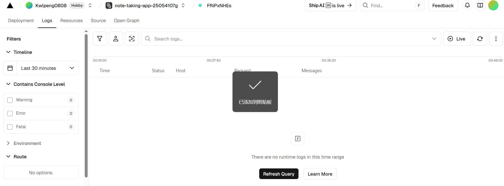
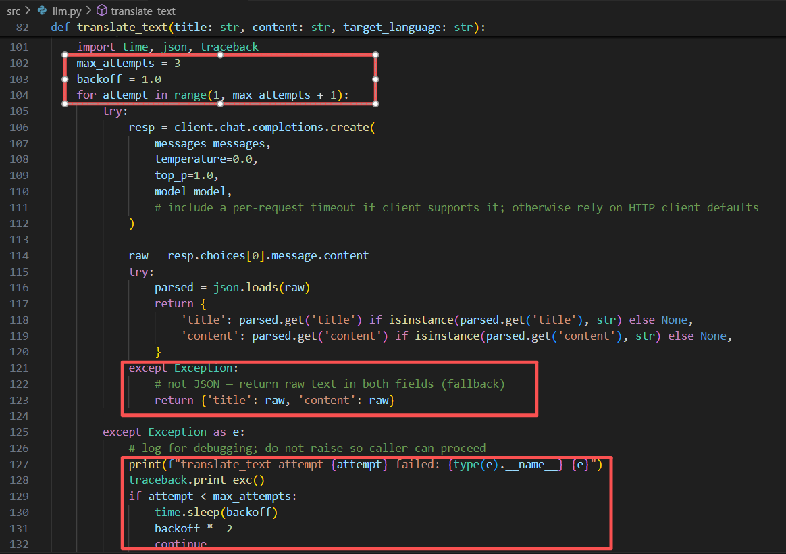
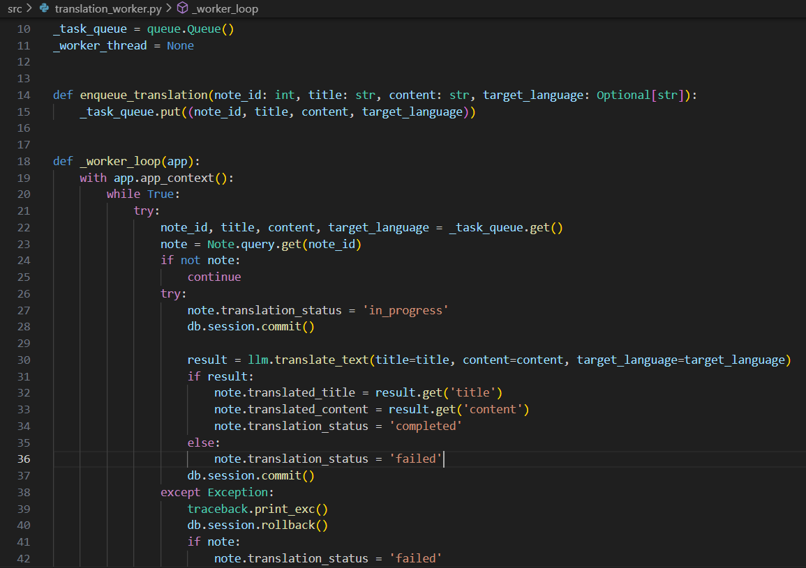
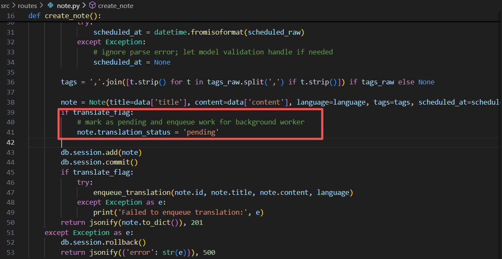

# Lab2 Writeup

A Report that contain the major steps for completing the tasks and some challenges in the tasks.

## 🚀 Main steps
The major steps for completing the tasks:

### Step1: Refactoring, New features implementing and Testing

#### Added tags and datetime functionality, allowing users to fill in tags and scheduled date/time when creating notes.

#### Implemented a note translation feature that supports 5 major languages, enabling users to switch freely as needed.

#### Implemented an AI-powered note generation feature, which parses user-input ideas into note titles, content, corresponding tags, and dates.

#### Refined the user interface and input controls to enhance the user experience.

#### Conducted testing and resolved bugs.
Solving "MaxClientsInSessionMode: max clients reached" when the remote pooler limits clients.

UI Styling Improvements

### Step2: Setting up of supabase

#### Determined the Supabase connection method.

#### Set database connection parameters in environment variables.

#### Updated the code to initialize and configure the database connection.

### Step3: Vercel deployment and handling the API keys, environment variables

#### Vercel Entry Point and Routing Configuration
Vercel uses index.py as the build/entry point. This file exports the Flask application to Vercel.
The build and routing rules for Vercel are defined in vercel.json, where all requests are routed to api/index.py.

#### Flask App / WSGI Callable
The Flask application is defined in src.main.app. The index.py file exposes it to Vercel via the statement from src.main import app.

#### Static Frontend Hosting
The Flask app is configured with static_folder set to src/static. Routes in main.py return index.html if no matching static file is found. Consequently, the frontend static pages are served by Vercel alongside the API.

#### Database and Runtime Environment Variables
main.py contains logic to detect the Vercel environment and the SUPABASE_DATABASE_URL:
If running on Vercel, it mandates SUPABASE_DATABASE_URL and uses it for SQLALCHEMY_DATABASE_URI.
To ensure secure database usage in the serverless environment, SQLALCHEMY_ENGINE_OPTIONS (e.g., connection pool size, overflow, timeout, pre-ping) are also controlled via environment variables within main.py.

#### Dependency Installation
During the build process, Vercel automatically installs packages listed in requirements.txt (e.g., psycopg2-binary, Flask, openai).

#### LLM Features and Token Management
LLM interactions are encapsulated in llm.py, which reads the GITHUB_TOKEN.
If the token is not configured, both the frontend and backend will return a service unavailable error.

#### API Route Registration and Frontend Interaction
All API blueprints are registered under the /api prefix during application startup. The route implementations are located in note.py and user.py (see src.routes.note and src.routes.user).

#### Final Deployment Steps on Vercel
Connect the GitHub repository to Vercel. (Note: The repository must be set to public for free deployment on Vercel).

Configure the required environment variables in the Vercel project settings. Sensitive keys (e.g., personal API keys) must be marked as secret to prevent exposure.

Initiate the deployment. Monitor the build and runtime logs in the Vercel dashboard to ensure the process completes without errors.

## 🌟 Challenges and Insights

### 1. LLM model response problems
When utilizing a large language model (LLM) to implement the translation and AI-based note generation features, the LLM server sometimes takes a considerable amount of time to return a response. This leads to a suboptimal user experience. Actually, this is fundamentally an issue with the external service (e.g., poor network conditions) and is beyond the control of my project's code.

Consequently, I considered how to optimize the feature logic to mitigate this poor user experience:

First, I implemented a three-retry mechanism: In [src/llm.py::translate_text], I added 3 retries with exponential backoff. This appropriately increases the number of system retry attempts, improving the chances of a successful request. Additionally, logging was incorporated to promptly print tracebacks when exceptions occur, facilitating future maintenance and debugging. Finally, even if the operation ultimately fails, it returns None to prevent blocking the note creation process.

Furthermore, I modified the translation request to be handled as an asynchronous background task (translation_worker). This avoids blocking user requests and allows for more robust handling of retries and persisting failed records. However, due to Vercel's serverless nature, this translation_worker does not start on Vercel (enabling it on Vercel would require deploying an external worker or using a cloud task/queue service, which is planned for future optimization).

Besides, the frontend status display was also optimized to show the translation status, helping users understand the current state and reducing confusion.

### 2. Consider the migration and adaptation of existing data
During this project development, I encountered the following issue while optimizing the translation feature: the frontend was updated to display the current translation status, and the backend used SQLAlchemy ORM queries to construct SQL SELECT statements that included a newly added translation_status column. However, this column did not yet exist in the actual database table. Consequently, PostgreSQL raised an UndefinedColumn error, causing the Flask route to return a 500 status code.

The solution was straightforward: executing an ALTER TABLE statement to add the missing column to the live database and committing the transaction to make the column visible to subsequent connections.

However, this gave me a strong reminder: in the software development process, we cannot focus solely on introducing new features and new data. Equal attention must be paid to ensuring the compatibility of these new features with existing data. Production environments often contain vast amounts of legacy data. Failure to handle this compatibility can lead to severe issues and significantly impact users. Therefore, when introducing new features, a key priority must be the adaptation and migration of existing data.

### 3. AI-generated code is powerful, but we cannot rely on it entirely.

In my project, I frequently use AI-generated code to help me modify or optimize feature logic. It is highly useful, intelligent, and efficient. However, I gradually realized that it sometimes gets stuck on the surface of a problem without providing a fundamental solution, and can even introduce hidden bugs. When this happens, I try to solve the problem myself. But because a significant portion of the code was AI-generated, I then have to spend considerably more effort in understanding the issue and identifying the root cause, which was a major headache at the time.

As discussed in class, when we become overly dependent on AI-generated code, it will subsequently take more effort for us to maintain and fix issues. I believe we must enhance our own knowledge reserves through more thorough learning. This enables us to better judge whether AI's actions and changes are reasonable, ensuring that AI truly becomes a tool for boosting efficiency, rather than a source of technical debt or messy code.

Furthermore, since AI's code changes can potentially introduce more issues, I think we can also leverage AI during testing to analyze code changes and identify the functionalities and modules that require regression testing coverage. This approach can help improve overall test coverage and enhance the effectiveness of our testing efforts.
